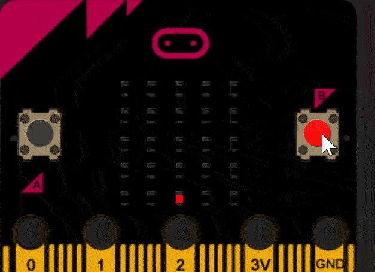

micro:bit Egg Catching Game
--------------------
   
In this assignment you will create a "catch the egg" game on your micro:bit in which an egg (represented by a single LED) "falls" from the top of the micro:bit LED display and can be caught by a moveable basket at the bottom.

By default, the first "egg" LED starts to drop from the center of the top line. The basket at the bottom will also be at the center, so the first egg will be very easy to catch. Subsequent "eggs" will then fall from random positions at the top of the display. The basket can be moved by pressing the buttons or by tilting the micro:bit.

You may find slides 95 - 98 of the [slide presentation](https://docs.google.com/presentation/d/1aiGcnPn8uoCJdX8p7_qoI3Hh3_KOhUtFeB3Byw0tacA/edit?usp=sharing) helpful in completing this assignment.

Program requirements
-----------------
* Your program must use the Python `randint()` function
* Your program will use at least 3 variables: `eggX`, `eggY`, `basketX`
* If an egg falls to the bottom of the screen without being caught, the game will display a "Game Over" message
* The position of the egg and the basket will be set with the `display.set_pixel()` function

Suggested steps to getting the egg to drop
----------
1. Write two `import` statements at the top of your program:
    * `from microbit import *`
    * `import random`
2. Declare and initialize a variable `eggX` with a value of 2
3. Declare and initialize a variable `eggY` with a value of 0
4. Underneath the variable declarations, create a `while True:` loop
   1. Inside the `while` loop call `display.clear()`
   2. On the next line, call `display.set_pixel()` to display the egg at position `eggX,eggY` with a value of `9`
   3. Set `eggY` to be larger by 1
   4. `sleep` for 500 milliseconds
5. Run the program, you should see the egg drop. If the egg falls past the bottom of the screen, you should see an error message

Suggested steps to adding the basket
----------
6. Under the other two variable declarations, declare and initialize a variable `basketX` with a value of 2
7. After `display.clear()`, call `display.set_pixel()` to display the basket at position `basketX,4` with a value of `4`
8. Now we'll see if the egg was caught by the basket. Underneath the `sleep(500), create a `if` that checks if `eggY` is equal to `5` `and` `eggX` is equal to `basketX`
   1. If so, set `eggY` to `0`
   2. Set `eggX` to a random integer from 0 to 4
9. Run the program, you should see the egg drop. When it reaches the basket, it should drop again from a random position at the top of the screen

Suggested steps to moving the basket
----------
10. After `display.clear()`, add two `if` statements
11. If `basketX` is greater than 0 `and` button a was pressed
    * Set `basketX` to be smaller by 1
12. If `basketX` is less than 4 `and` button b was pressed
    * Set `basketX` to be larger by 1
13. Run the program, you should be able to move the basket to catch the egg. If you miss the egg and it falls past the bottom of the screen, you should see an error message

Suggested steps to ending the game
----------
14. After `display.clear()`, write an `if` statement that checks if `eggY` is greater than 4
    * if so, use `display.scroll()` to display a game over message
15. Directly underneath, add an `else:`
16. Indent *all* the code under the `else:` so that the game continues to play only if the egg has not gone off the bottom of the screen  
17. Run the program, you should have the basics of a working game
18. Now you can modify the game to add extra features like a score, animations or levels
19. Submit the code for your finished program and a short video of it running  
    
Extensions
----------
You can move the basket with the accelerometer rather than the buttons. You could also keep score of the number of eggs caught and display the score along with the game over message.

Samples of Student Work
----------
[Evangeline](Evangeline.png)   
[Linen](LinenEgg.GIF)   
[Jasmine](JasmineEgg.gif)   
